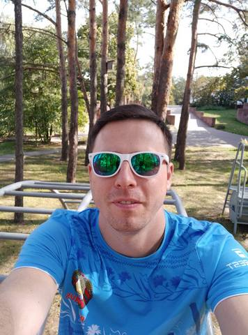

# Alexei Kozovski

## Contact information:
* **Phone:** +375(29)1818432
* **E-mail:** akoz413@mail.ru
* **Telegram:** [@AlexeiKozovski](https://t.me/AlexeiKozovski)
* **GitHub:** [AlexeiKozovski](https://github.com/AlexeiKozovski)
* **Discord:** Alexei Kozovski

## About myself:
I currently live and work in Minsk. I'm 34 years old. I work as an engineer in a design institute. I am engaged in the development of power supply and electric lighting systems.

I have always been interested in programming. Three years ago I decided to change my profession and become a programmer. I started learning the Java programming language. But I had little free time and a lot of work.

Now I am full of energy and determination and ready to dive into learning front-end development. And I will go to the bitter end!

## Skills
* Java Basic
* HTML, CSS
* JavaScript Basics
* Git, GitHub
* IntelliJ IDEA, VS Code 

## Code examples
### Codewars Kata: Can we divide it?
Your task is to create the functionisDivideBy to check if an integer number is divisible by both integers a and b.
```
let isDivideBy = (number, a, b) => {
  if (number % a === 0 && number % b === 0) {
    return true
  } else {
    return false
  }
}
```
## Experience
I have no programming experience. I have some experience with programming courses on Java and JavaScript

## Projects
* [Shelter (RS School)](https://rolling-scopes-school.github.io/alexeikozovski-JSFE2022Q1/Shelter/pages/main/index.html)
* [CSS Mem Slider (RS School)](https://AlexeiKozovski.github.io/cssMemSlider/cssMemSlider/index.html)


## Education and courses:
* Belarusian National Technical University
  + Energy Faculty (Electricity supply)
* IT-Acaademy
  + Basics Computer Science
  + Programming on Java. Basics
* RS School
  + JavaScript/Front-end. Stage#0 
  + JavaScript/Front-end. Stage#1 
  + JavaScript/Front-end. Stage#2 (in progress...)

## Languages
* English - В1 (B2 - Epam test)